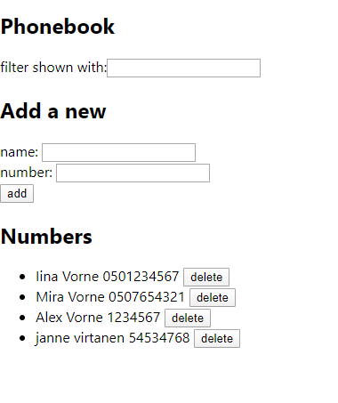
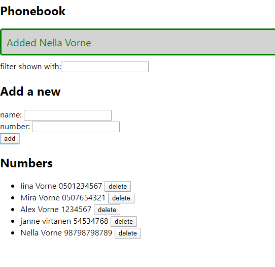

# Web-sovellukset 2020 

## Valmistaudu jaksoon
Tee versionhallintaan repositoriot nimeltä Web-app sekä Portfolio.

Tutorial-tehtävät nimetään tehtävän mukaan, esim. teht1.html ja palautetaan versionhallintaan Web-app repositorioon tehtävän mukaan nimettyyn kansioon, esim. /Tutorial/Teht1/teht1.html. 
  
Portfolio on koko jakson ajan laajentuva tehtävä, jonka seuraava versio voidaan tallentaa aina edellisen päälle. Portfoliota tehdään siis iteratiivisesti. Projektista täytetään myös työaikakirjanpitoa. Työaikakirjanpidosta tehdään tyoaikakirjanpito.md -tiedosto versionhallintaan.  

Tee tyoaikakirjanpito.md -tiedostoon taulukko mallin mukaan. Palauta versionhallintaan Web app repositorion kansioon Dokumentointi. 

| Pvm. | Käytetty aika | Aihe |
| ------------- | ------------- | ------------- |
| 1.1.2020 | 3h  | HTML projektisivun tekeminen. |
| 2.1.2020 | 8h  | Puhelinluettelon lisää -nappulan toiminnallisuuden ohjelmointi.  |
| 3.1.2020 | 1h  | Puhelinluettelon lisää -nappulan yksikkötestaaminen. |
| **Yhteensä** | **12h** |  |  
 
## Sisältö ja tehtävät
1. **Tehtävä: HTML tutorial**
  * Katso tutorial: https://youtu.be/UB1O30fR-EE
  * Tee HTML-sivu videon ohjeiden mukaisesti.
  * Palauta versionhallintaan.  
2. **Tehtävä: Portfolion HTML** 
  * Aloita Websovelluksena toteutettu Portfolio-projekti tekemällä valmiiksi HTML rakenne. Sisällön tulisi sisältää ainakin:
  ** Aloitussivu, jossa esittelet itsesi 
  ** Unity: linkit tekemiisi nettipeleihin.
  ** Python: Vihollispelin sekä Tasklistin asennus 
  ** Puhelinluettelo: Web app:
  

* Nimeä aloitussivu nimellä index.html ja palauta Portfolioon.

3. **Tehtävä: CSS tutorial**
  * Katso tutorial: https://youtu.be/yfoY53QXEnI
  * Tee videon tyylitiedostoharjoitus.
  * Palauta versionhallintaan.
  
4. **Tehtävä: Portfolion CSS** 
  * Tee puhelinluetteloosi ulkoinen tyylitiedosto. Muokkaa:
    * Taustakuva
    * Otsikoiden fontti, väri ja koko. Keskitä otsikot keskelle sivua. 
    * Leipätekstin fontti tyyli ja koko.
    * Tee listan bulleteista kuvia.
    * Tee jokaisesta sivun osiosta div, jossa on pyöreät kulmat ja taustakuvasta erottuva taustaväri: Phonebook, Add a new, Numbers
    * Muokka lomakkeiden kenttien reunojen väriä.
    * Tee nappuloista mustia valkoisella tekstillä.
    * Palauta versionhallintaan.

5. **Tehtävä: BOOTSTRAP**
  * Tutki Bootstrapin toimintaa
    * https://getbootstrap.com/
    * https://www.w3schools.com/bootstrap4/default.asp
    * Käytä Bootstrapia vähintään portfoliosi responsiivisuuden sekä navigoinnin toteuttamiseen.  

7. **Tehtävä: JAVASCRIPT**
  * Katso tutorial: https://youtu.be/hdI2bqOjy3c
  * Tee videon JavaScript-harjoitus.
  * Palauta versionhallintaan.
  * EI ERILLISTÄ PORTFOLIO -TEHTÄVÄÄ

8. **Tehtävä: JSON**
  * Katso tutorial: https://youtu.be/wI1CWzNtE-M
  * Tee videon JSON-harjoitus.
  * Palauta versionhallintaan.
  * EI ERILLISTÄ PORTFOLIO -TEHTÄVÄÄ

9. **Tehtävä: REACT JS**
  * Katso tutorial: https://youtu.be/sBws8MSXN7A
  * Tee videon React JS-harjoitus.
  * Palauta versionhallintaan.
  
10. **Tehtävä: Portfolion puhelinluettelon React JS** 
  * Tee puhelinluettelon frontend React JS:lla: kovakoodatulla datalla, ei vielä toiminnallisuutta.
    
11. **Tehtävä: NODE.JS**
  * Katso tutorial: https://youtu.be/fBNz5xF-Kx4
  * Tee videon Node.js-harjoitus.
  * Palauta versionhallintaan.
  
12. **Tehtävä: Portfolion puhelinluettelon Node.js** 
  * Tee puhelinluettelo backend Node.js:llä.

13. **Puhelinluettelo**
  * Tee puhelinluetteloon Lisää -toiminnallisuus, eli lomakeelta voi lisätä lisää yhteystietoja.

14. **Puhelinluettelo**
  * Tee projektiin Poista -toiminnalisuus.

15. **Puhelinluettelo**
  * Tee projektiin Filter -toiminnallisuus.

16. **Puhelinluettelo**
  * Tee projektiin Notification -toiminnallisuus
    * Yhteystieto lisätty
    * Nimi tai numero puuttuu
    * Yhteystieto poistettu 
    * Notification poistuu sivulta 5 sek. kuluttua.

    

17. **Puhelinluettelo**
    * Toggle -toiminnallisuus
    * Näytä / piilota uuden yhteystiedon lisäyslomake nappia painamalla.
